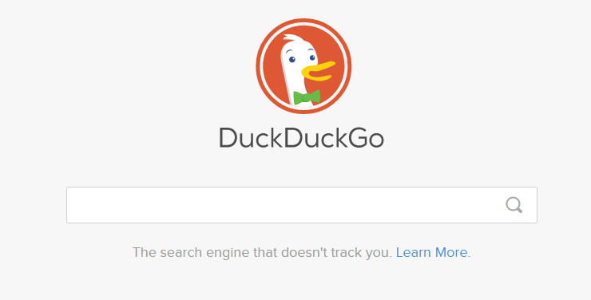

# Lab 1 - Anonimnost na Internetu

Moglo bi se reći da je Internet izgrađen na temeljima anonimnosti, otvarajući put prema slobodi govora. Međutim, u današnje vrijeme sve veći porast je velikih tvrtki poput Amazona, Googlea, Facebooka i Microsofta koje prikupljaju privatne podatke s ciljem posluživanja targetiranih oglasa korisnicima usluga i servisa takvih tvrtki.

Naravno, uvijek će postojati razlozi s kojima ljudi žele osigurati anonimnost na Internetu, te nema ništa loše u tome, bez obzira na to što radite. Jedini način da ostanemo uistinu anonimni na Internetu je... da uopće ne idemo na Internet, što zapravo za većinu nas ne predstavlja prihvatljivu opciju. U nastavku ove vježbe će se dati pregleda alata onoga što možete učiniti kako biste smanjili špijuniranje, ciljane oglase i krađu osobnih dokumenata dok istražujete svijet na Internetu.

## Anonimnost IP adrese

Što vaše računalo otkriva o vama kad posjetite web stranicu? Web lokacija u najmanju ruku zna vašu IP adresu.
- [Iplocation](http://www.iplocation.net/)
- [BrowserLeaks.com](https://browserleaks.com/)
- [EFF's Panopticlick tool](https://panopticlick.eff.org/)
- [Privacy Badger](https://www.eff.org/privacybadger)
- [Ghostery browser extension](https://www.ghostery.com/)

## Sigurno surfanje

U izborniku postavki isključite mogućnost da preglednik pohranjuje lozinke koje upotrebljavate za pristup web mjestima i uslugama.

- [LastPass](https://www.lastpass.com/)
- [Dashlane](https://www.dashlane.com/)

## Anonimni način prtetraživanja

U Chrome-u se zove Incognito (Ctrl+Shift+N to access); u Firefoxu ima naziv Private Browsing (Ctrl+Shift+P); dok Microsoft Edge i Internet Explorer također upotrebljavaju Private browsing (also Ctrl+Shift+P).

## Deaktiviranje Javascript-a
- [NoScript](https://noscript.net/)
- [ScriptSafe](https://www.andryou.com/scriptsafe/)

Postoje web preglednici koji su fokusirani na privatnost
Temeljni na Google's Chromium engine-u.

- [Epic Browser](https://www.epicbrowser.com/)
- [Comodo Browser](https://www.comodo.com/home/browsers-toolbars/browser.php)
- [Epic Browser](https://www.opera.com/)
- [Tor Browser](https://www.torproject.org/)

## Korištenje drugih pretraživača
- [Duck Duck Go](https://duckduckgo.com/)
- [Startpage](https://www.startpage.com/)

## Proxy, VPN i Tor
- [Foxy Proxy](https://getfoxyproxy.org/)
- [Browsec VPN](https://addons.mozilla.org/hr/firefox/addon/browsec/)
- [Tor Browser](https://www.torproject.org/)

## Anonimni email
- [ProtonMail](https://protonmail.com/)
- [Guerrilla Mail](https://www.guerrillamail.com/)

## Korisni Linkovi:

- https://www.pcmag.com/news/how-to-create-an-anonymous-email-account
- https://www.pcmag.com/how-to/how-to-stay-anonymous-online