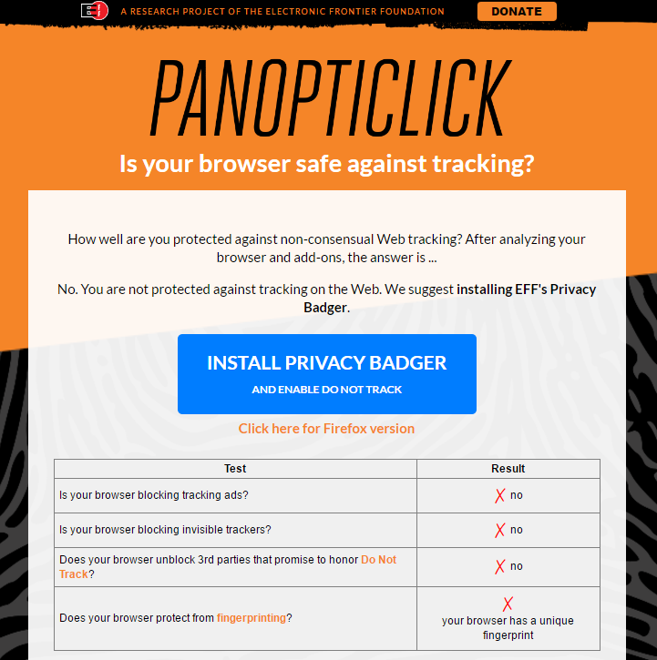
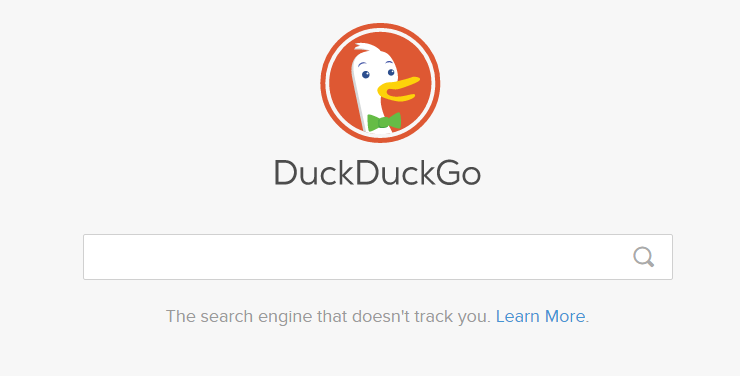

# Lab 1 - Anonimnost na Internetu

Moglo bi se reći da je Internet izgrađen na temeljima anonimnosti, otvarajući put prema slobodi govora. Međutim, u današnje vrijeme sve veći porast je velikih tvrtki poput Amazona, Googlea, Facebooka i Microsofta koje prikupljaju privatne podatke s ciljem posluživanja targetiranih oglasa korisnicima usluga i servisa takvih tvrtki.

Naravno, uvijek će postojati razlozi s kojima ljudi žele osigurati anonimnost na Internetu, te nema ništa loše u tome, bez obzira na to što radite. Jedini način da ostanemo uistinu anonimni na Internetu je… da uopće ne idemo na Internet, što zapravo za većinu nas ne predstavlja prihvatljivu opciju. U nastavku je pregled alata i postupaka kojima možete smanjiti špijuniranje, ciljane oglase i krađu osobnih dokumenata dok istražujete svijet na Internetu.

## Upute za studente

**Cilj vježbe:** znati objasniti što web stranica i mreža mogu otkriti o posjetitelju; znati barem nekoliko mjera smanjenja traga; povezati to s ulogom forenzičara (trag kao dokaz / trag kao rizik za zaštićenu osobu).

**Tijek rada (redoslijed):**

1. Pročitajte uvod i odjeljak *Zašto ovo ima smisla u forenzičkim znanostima*.
2. Pročitajte *Pravila i pravno-etički okvir* — vrijedi prije bilo kakvog praktičnog isprobavanja.
3. Prođite tematske odjeljke ispod (IP i otisak, lozinke, privatni način rada, JavaScript, preglednici, tražilice, VPN/Tor, email). **Obavezno isprobajte** najmanje **dva** alata iz odjeljka *Anonimnost IP adrese i otisak preglednika* na računalu na kojem vam je to dopušteno (vlastiti uređaj ili laboratorijsko računalo prema pravilima nastavnika).
4. U timu provedite **grupni zadatak** (memorandum Mramor, Tor, Proton, fragmenti, fuzija) prema odjeljku *Grupni zadatak* i [grupni_scenarij_tim7.md](grupni_scenarij_tim7.md).
5. Predajte **jedan grupni PDF** (samo timska predaja; nema pojedinačnih podzadataka). Rok i mjesto objavljuje nastavnik (npr. LMS, e-mail).

## Zašto ovo ima smisla u forenzičkim znanostima

Isti principi koji **štite privatnost** pomažu i da **razumijete digitalni trag**: što web lokacija ili usluga može zaključiti o posjetitelju (IP adresa, otisak preglednika, kolačići, prijava na račun). U kasnijim vježbama (napredno pretraživanje, OSINT) te informacije postaju dio alata istražitelja — ovdje ih promatrate s **dvije uloge**: zaštita osjetljivog subjekta (npr. svjedok, žrtva, izvor) i svjesnost o tome što se u praksi može korelirati do identiteta.

**Dvostruka upotreba znanja:** alati i tehnike mogu se upotrijebiti i za zaštitu i za zlostavljanje. U okviru kolegija koristite ih isključivo u **dopuštenom, etičkom i pravno prihvatljivom** kontekstu (vlastiti uređaj, javno dostupni podaci, okvir ove vježbe).

## Pravila i pravno-etički okvir

Pročitajte prije praktičnog rada.

- **Osobni podaci** (u smislu opće prakse poput GDPR-a): sve što može identificirati osobu ili je s njom povezati — nekad i “tehnički” identifikatori (npr. jedinstveni otisak preglednika u kombinaciji s drugim signalima).
- **Zabranjeno u ovoj vježbi:** neovlašten pristup tuđim računima, “testiranje” tuđih lozinki, zaobilazenje sigurnosnih mjera ili prikupljanje podataka o osobama izvan javno dostupnih izvora i izvan zadataka koje zada nastavnik.
- **Grupni scenarij s temom “istraživačko novinarstvo”:** smije se raditi **isključivo na fiktivnom predmetu** (izmišljena općina, osobe, stranke, dokumenti koje vam da nastavnik ili sami izmislite). **Ne smije** se u okviru laba provoditi istraga, objava ili insinuacija u odnosu na **stvarne** političare, stranke ili žive osobe — cilj je **metoda i zaštita komunikacije**, ne stvarni politički udar.
- **Javno dostupno** nije isto što i **etički ili pravno prihvatljivo u svakom kontekstu** — stručno ponašanje uključuje dokumentiranje izvora i poštivanje granica ovlasti i svrhe.

## Anonimnost IP adrese i otisak preglednika

Što vaše računalo otkriva o vama kad posjetite web stranicu? Web lokacija u najmanju ruku zna vašu IP adresu; uz JavaScript i druge mehanizme često se može dobiti i bogatiji **otisak** okruženja.

- [Iplocation](http://www.iplocation.net/)
- [BrowserLeaks.com](https://browserleaks.com/)
- [EFF Cover Your Tracks](https://coveryourtracks.eff.org/) (ranije Panopticlick)
- [Privacy Badger](https://www.eff.org/privacybadger)
- [Ghostery browser extension](https://www.ghostery.com/)

## Sigurno surfanje i lozinke

U izborniku postavki isključite mogućnost da preglednik pohranjuje lozinke koje upotrebljavate za pristup web mjestima i uslugama. Umjesto toga koristite **menadžer lozinki** — pri odabiru usluge obratite pažnju na **dvofaktorsku autentikaciju**, politiku sigurnosnih incidenata i otvorenost oko kriptografije, ne samo na naziv brenda.

Primjeri (informativno; usporedite aktualne uvjete i reputaciju):

- [Bitwarden](https://bitwarden.com/)
- [1Password](https://1password.com/)
- [KeePass](https://keepass.info/) (lokalno čuvanje, više odgovornosti na korisniku)

## Anonimni način pretraživanja

U Chrome-u se zove Incognito (Ctrl+Shift+N); u Firefoxu Private Browsing (Ctrl+Shift+P); Microsoft Edge također koristi InPrivate (Ctrl+Shift+N). **Napomena:** privatni način uglavnom ne sprema povijest na uređaju, ali **ne čini vas nevidljivim** pružatelju interneta, poslodavcu na poslovnom računalu niti web stranici — ona i dalje vidi vašu mrežnu vezu i može postavljati kolačiće u sesiji.

## Deaktiviranje JavaScript-a

- [NoScript](https://noscript.net/)
- [ScriptSafe](https://www.andryou.com/scriptsafe/)

Postoje web preglednici usmjereni na privatnost, mnogi na Chromium motoru:

- [Epic Browser](https://www.epicbrowser.com/)
- [Comodo Dragon](https://www.comodo.com/home/browsers-toolbars/browser.php)
- [Opera](https://www.opera.com/) (ugrađeni VPN u pregledniku — razumijte ograničenja: promet ide pružatelju koji vam Opera odredi)
- [Tor Browser](https://www.torproject.org/)

## Korištenje drugih pretraživača

- [DuckDuckGo](https://duckduckgo.com/)
- [Startpage](https://www.startpage.com/)

## Proxy, VPN i Tor

- [FoxyProxy](https://getfoxyproxy.org/)
- [Browsec VPN](https://addons.mozilla.org/hr/firefox/addon/browsec/)
- [Tor Browser](https://www.torproject.org/)

**VPN** tipično štiti promet između vašeg uređaja i VPN poslužitelja od lokalne mreže i ISP-a; **web stranica i dalje vidi** da joj netko pristupa (često kroz izlaznu IP adresu VPN-a). **Tor** drugačije raspoređuje promet kroz više čvorova i ima drugačiji model prijetnje i performansi — nije zamjena za “brzi VPN za sve”, nego alat s jasnim ograničenjima i pravilima korištenja.

## Anonimni email

- [Proton Mail](https://proton.me/mail)
- [Guerrilla Mail](https://www.guerrillamail.com/)

## Grupni zadatak (tim ~7 studenata): fiktivna istraživačka redakcija

**Zašto ovo ima smisla:** visokorizična tema (osjetljivi izvori, pritisak na novinare) zahtijeva **disciplinu**: odvojeni identiteti, Tor za osjetljive korake, šifrirana pošta, svjesnost otiska. U grupi se vidi gdje “curi” trag (npr. netko se prijavi na osobni Gmail u istom pregledniku).

**Tvrd pravilo:** predmet je **100 % fiktivan** (npr. “Grad Mramor”, izmišljena imena). Nema pretraživanja stvarnih političara, nema dijeljenja sadržaja na društvenim mrežama, nema povezivanja vježbe s uživo događajima.

**Materijali za scenarij (novinarstvo + fuzija):**

- [memorandum_fiktivni_slucaj.md](memorandum_fiktivni_slucaj.md) — zajednički „dokument predmeta“ koji čitaju svi; **ne sadrži sve činjenice**.
- [grupni_scenarij_tim7.md](grupni_scenarij_tim7.md) — **faze rada** i **točan popis poglavlja grupnog PDF-a** (jedina predaja za ovaj lab).
- [instruktor_fragments_tim7.md](instruktor_fragments_tim7.md) — **samo za nastavnika**: sedam odvojenih fragmenata (jedan po ulozi) + ključ za provjeru fuzije — **ne davati cijelu datoteku studentima**.

### Uloga tima (7 mjesta — prilagodite imenima)

| # | Uloga | Što radi na vježbi |
|---|--------|-------------------|
| 1 | **Urednik / koordinator** | Koordinacija i **fuzija**: prima sve poruke na Protonu, iz memoranduma + 7 fragmenata sastavlja konačni sažetak. Šalje **svoj** fragment (`MRAMOR-FRAG-01`) iz Tora kao i ostali; radi **osobnu** provjeru traga. |
| 2 | **Operativna sigurnost** | Instalira/provjeri [Tor Browser](https://www.torproject.org/); svima pokaže kako se u Toru otvara Proton; provjeri da nitko ne koristi školski ili osobni račun u istoj sesiji za “redakciju”. |
| 3–4 | **Komunikacija s izvorom (2 osobe)** | Mogu pomoći pri otvaranju **sandučića redakcije** (primatelj). **Svaki** član tima šalje fragment **sa svog** Proton računa **na** tu zajedničku adresu (preporuka) — vidi [grupni_scenarij_tim7.md](grupni_scenarij_tim7.md). |
| 5 | **Analitičar traga** | Vodi **tehničke** usporedbe Tor vs. obični preglednik; pomaže timu interpretirati otisak. I sam šalje svoj fragment i radi **osobnu** provjeru traga (kao i svi ostali). |
| 6 | **Metapodaci / dokumenti** | Naglasi zabranu **riskantnih privitaka**; pazi da fragmenti idu kao čisti tekst. Šalje svoj fragment + osobnu provjeru traga. |
| 7 | **Zapisnik / predaja** | U grupni PDF uključuje **fuzirani sažetak** (od urednika), **7 osobnih potvrda anonimnosti**, zajedničku tablicu Tor/normalno, protokol slanja `MRAMOR-FRAG-XX` i popis pogrešaka. |

### Minimalni tehnički koraci (svi u timu)

1. **Tor Browser** preuzeti s `torproject.org` (ne s nepoznatih izvora); kratko pročitati [upozorenja](https://tb-manual.torproject.org/) (npr. ne instalirati dodatke koji ruše model anonimnosti).
2. **Proton Mail:** **jedna adresa redakcije (primatelj)** + **svaki student svoj račun za slanje** (preporuka; detalj u [grupni_scenarij_tim7.md](grupni_scenarij_tim7.md)). Registracija i slanje **u Toru** kad je moguće. Alternativa: jedan zajednički račun i slanje u smjenama — brže, manje realistično.
3. **Test anonimnosti:** **svaki** član samostalno radi usporedbu normalno vs. Tor i piše **kratku osobnu potvrdu** (vidi faze u [grupni_scenarij_tim7.md](grupni_scenarij_tim7.md)). U grupni PDF ide i **zajednička tablica** ili zbir potpisa tko je što mjerio.
4. **Fuzija:** urednik iz memoranduma + sedam e-mail poruka s fragmentima sastavlja **jedinstveni sažetak predmeta**; nitko na početku nema cijelu sliku — to je namjera vježbe.
5. **Što ne raditi (checklist):** lokacija na mobitelu tijekom osjetljive sesije; osobni kolačići u istom profilu kao Proton; slanje s fakultetskog maila na “desk” bez dogovora; **usmeno otkrivanje fragmenata** prije slanja (nastavnik može zabraniti).

### Predaja — samo grupni PDF

Jedan **PDF po timu** (ne predaju se pojedinačni dokumenti s podzadacima). Struktura i sadržaj: točno je navedeno u odjeljku *Faza 4 — Predaja* u [grupni_scenarij_tim7.md](grupni_scenarij_tim7.md) (naslovnica, fuzija, tablica Tor/normalno, sedam osobnih potvrda, protokol fragmenata, popis pogrešaka).

*Napomena nastavniku:* fragmente dijelite iz [instruktor_fragments_tim7.md](instruktor_fragments_tim7.md) **pojedinačno po ulozi**; ne otvarajte prostor za stvarne političke mete.

## Poveznica na sljedeće vježbe

Potpuna “anonimnost” u praksi je rijetka i ovisi o prijetnji. U **Labu 2** precizirate pretraživanje (operatori, izvori); u **Labovima 3 i 4** javno dostupni tragovi postaju predmet **OSINT** metodologije — znanje iz ovog laba pomaže procijeniti **što je ostavljeno van tražilice** (mreža, preglednik, identifikatori).

## Korisni linkovi

- https://www.pcmag.com/news/how-to-create-an-anonymous-email-account
- https://www.pcmag.com/how-to/how-to-stay-anonymous-online
