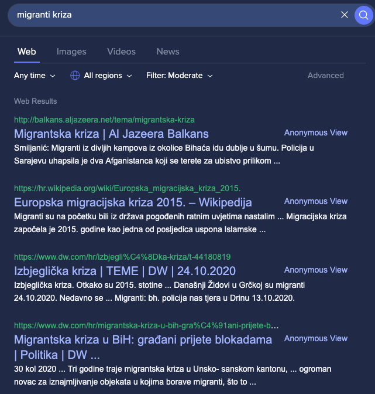
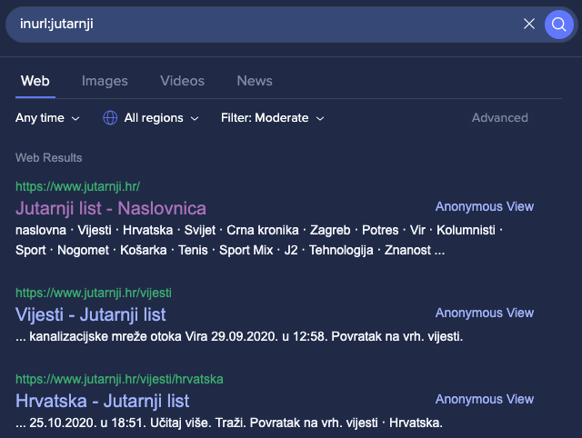
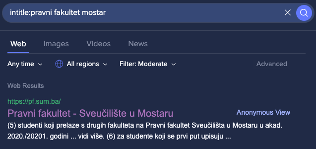
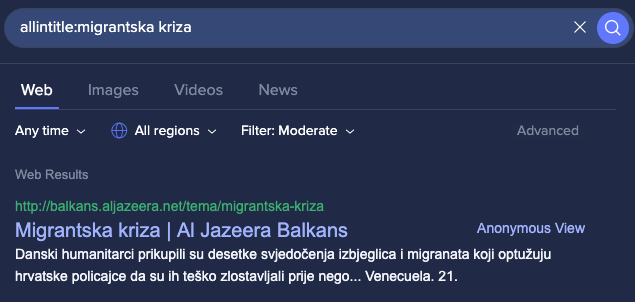

# Lab 2 - Napredno pretraživanje

U ovoj vježbi studenti će se upoznati sa osnovnim i naprednim vještinama pretraživanja na Google-u. Pri tome će se upotrebljavati tražilica iz prethodne laboratorijske vježbe: [Startpage](https://www.startpage.com/)

## Osnovno pretraživanje 

Gotovo svaki rezultat koji Google vrati se sastoji od tri dijela, a to su naslov, url i sadržaj.

## Napredno pretraživanje 

Vještine koje će se proći u ovoj vježbi se mogu se grubo podijeliti u tri kategorije: usmjerene na lokaciju, usmjerene na sadržaj i druge.

### 1. Usmjerene na lokaciju

Na taj način možemo filtrirati stranice prema lokaciji. konkretno, možemo koristiti web mjesto i url stranice za kontrolu lokacije.

#### 1.1. Site

Samim imenom možemo pretragu prilagoditi kako bi rezultat bio ograničen na neko određeno mjesto i lokaciju, pri čemu se misli na domenu web stranica. Prilikom pretraživanja se može koristiti ključna riječ web stranice.

Primjerice, ako se želi pretražiti ​​stranica koje sadrži izraze **migranti kriza**, pretragu možemo upisati kako je navedeno na slici:

Kao što se može vidjeti na gornjoj slici, stranice s rezultatima sadrže migranti i/ili kriza, ali sada želimo stranice samo s neke domene, recimo **jutarnji.hr**, jer stranice s ove domene imaju veću vjerojatnost visokokvalitetnog sadržaja, tako da svoju pretragu možemo prilagoditi na sljedeći način:

#### 1.2. url

Dalje možemo nešto učiniti sa url-om stranice. Prilikom pretraživanja postoje dva povezana operatora: inurl i allinurl.

#### 1.2.1. inurl

Na primjer, želimo stranice čiji urlovi sadrže **jutarnji**, tako da svoju pretragu možemo konstruirati ovako:

#### 1.2.2. allinurl

Ključna razlika između allinurl i inurl je u tome što potonji zahtijeva da sve ključne riječi budu sadržane u url-u, dok prve zahtijevaju da barem jedna od ključnih riječi predstavlja url.

## 2. Usmjereno prema sadržaju

Ovakvom vrstom pretraživanja možemo prilagoditi svoje pretraživanje prema naslovu, tijelu i tipu stranice rezultata. Prilikom pretraživanja imamo odgovarajuće ključne riječi **intitle**, **allintitle**, **intext**, **allintext** i **filetype** za postizanje ovih ciljeva.

### 2.1. Naslov

Pretražite stranice čiji naslovi odgovaraju nekoj ključnoj riječi

#### 2.1.1. intitle

Primjerice, želimo pretraživati ​​stranice čiji naslovi sadrže ključnu riječ **Pravni fakultet Mostar**, možemo to učiniti ovako:

Napomena: prilikom pretraživanja ne razlikuju se velika i mala slova.

#### 2.1.1. allintitle

Operatori s prefiksom *all* zahtijevaju da sve ključne riječi postoje istovremeno.

Na primjer, ako želimo pretraživati ​​stranice čiji naslovi sadrže ključnu riječ **migrantska kriza**, možemo učiniti ovako:

#### 2.2 intext
Potražite dio tijela html stranice.

#### 2.2.1 intext
Na primjer, želimo pretraživati ​​stranice čije tijelo sadrži **pravni fakultet mostar**, možemo to napisati:

#### 2.2.2 allintext

intext zahtijeva barem jednu ključnu riječ u pretraživanju.  Ako želimo da tijelo stranice sadrži sve tri ključne riječi, možemo koristiti allintext:

A ako kontinuirano želimo tri ključne riječi sadržane u tijelu stranica, možemo koristiti dvostruke navodnike.

### 2.3 Filetype
Pronađite i preuzmite različite vrste dokumenata.

Na primjer, želimo pretražiti neke pdf datoteke koje sadrže ključnu riječ **Kibernetička sigurnost**, tipkali bismo pretragu ovako:

ali ako ne koristimo filetype operator i samo upišemo **Kibernetička sigurnost pdf**, veća je vjerojatnost da nećemo dobiti očekivane rezultate:

## 3. Drugi
Postoje neki operatori koji se mogu koristiti i u pretraživanju usmjerenom prema lokaciji i prema sadržaju, poput znaka minus i dvostrukih navodnika.

### 3.1 Znak minus
Uklonite nebitne rezultate

### 3.2 Dvostruki navodnici
Pretražite točnu frazu

## Caveats
- svaka riječ u upitu je bitna
- važan je redoslijed riječi
- riječi ne razlikuju velika i mala slova
- nikad ne vjerujte jednom izvoru

## Reference

- [Search Smarter: 30+ Google Search Tricks You Might Not Already Know](https://zapier.com/blog/advanced-google-search-tricks)
- [Google Search Education](https://www.google.com/intl/en-us/insidesearch/searcheducation/)
- [20 Google Search Tips to Use Google More Efficiently](https://www.lifehack.org/articles/technology/20-tips-use-google-search-efficiently.html)
- [Google Search Operators: The Complete List (42 Advanced Operators)](https://ahrefs.com/blog/google-advanced-search-operators/)
- [How to Find Movie in Google Search](https://www.youtube.com/watch?v=UKmknyasDWk)