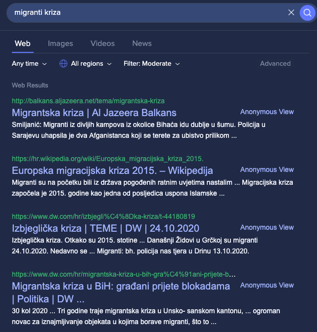
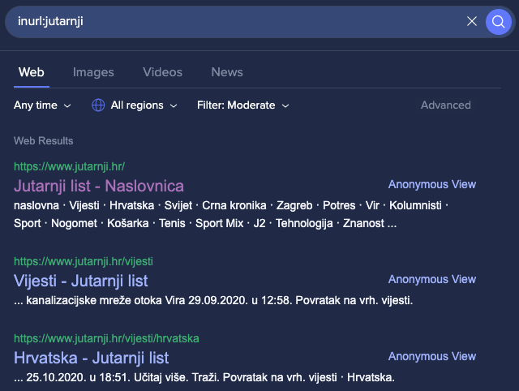
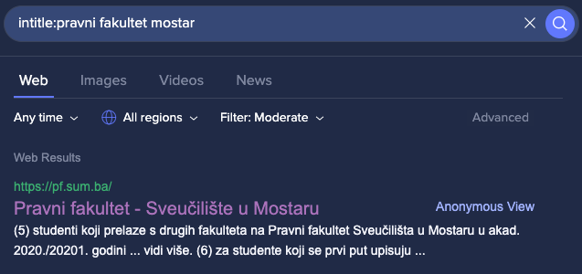
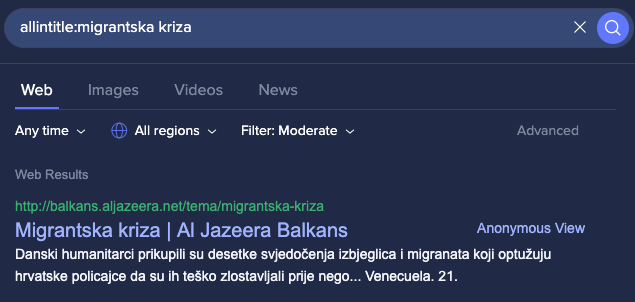

# Lab 2 - Napredno pretraživanje

U ovoj vježbi studenti će se upoznati sa osnovnim i naprednim vještinama pretraživanja na Google-u. Pri tome će se upotrebljavati tražilica iz prethodne laboratorijske vježbe: [Startpage](https://www.startpage.com/). **Smisao vježbe:** kad naučite suziti rezultate operatorima, brže dolazite do pouzdanijih izvora — to štedi vrijeme na seminarskom radu i na kasnijim temama (npr. OSINT), jer ne gubite sate na listanje nebitnih pogodaka. Strukturirani zadatak s predajom je u odjeljku **Strukturirani zadatak** nakon pregleda operatora u nastavku.

## Osnovno pretraživanje 

Gotovo svaki rezultat koji Google vrati se sastoji od tri dijela, a to su naslov, url i sadržaj.

## Napredno pretraživanje 

Vještine koje će se proći u ovoj vježbi se mogu se grubo podijeliti u tri kategorije: usmjerene na lokaciju, usmjerene na sadržaj i druge.

### 1. Usmjerene na lokaciju

Na taj način možemo filtrirati stranice prema lokaciji. konkretno, možemo koristiti web mjesto i url stranice za kontrolu lokacije.

#### 1.1. Site

Samim imenom možemo pretragu prilagoditi kako bi rezultat bio ograničen na neko određeno mjesto i lokaciju, pri čemu se misli na domenu web stranica. Prilikom pretraživanja se može koristiti ključna riječ web stranice.

Primjerice, ako se želi pretražiti ​​stranica koje sadrži izraze **migranti kriza**, pretragu možemo upisati kako je navedeno na slici:

Kao što se može vidjeti na gornjoj slici, stranice s rezultatima sadrže migranti i/ili kriza, ali sada želimo stranice samo s neke domene, recimo **jutarnji.hr**, jer stranice s ove domene imaju veću vjerojatnost visokokvalitetnog sadržaja, tako da svoju pretragu možemo prilagoditi na sljedeći način:

#### 1.2. url

Dalje možemo nešto učiniti sa url-om stranice. Prilikom pretraživanja postoje dva povezana operatora: inurl i allinurl.

#### 1.2.1. inurl

Na primjer, želimo stranice čiji urlovi sadrže **jutarnji**, tako da svoju pretragu možemo konstruirati ovako:

#### 1.2.2. allinurl

Ključna razlika između allinurl i inurl je u tome što potonji zahtijeva da sve ključne riječi budu sadržane u url-u, dok prve zahtijevaju da barem jedna od ključnih riječi predstavlja url.

## 2. Usmjereno prema sadržaju

Ovakvom vrstom pretraživanja možemo prilagoditi svoje pretraživanje prema naslovu, tijelu i tipu stranice rezultata. Prilikom pretraživanja imamo odgovarajuće ključne riječi **intitle**, **allintitle**, **intext**, **allintext** i **filetype** za postizanje ovih ciljeva.

### 2.1. Naslov

Pretražite stranice čiji naslovi odgovaraju nekoj ključnoj riječi

#### 2.1.1. intitle

Primjerice, želimo pretraživati ​​stranice čiji naslovi sadrže ključnu riječ **Pravni fakultet Mostar**, možemo to učiniti ovako:

Napomena: prilikom pretraživanja ne razlikuju se velika i mala slova.

#### 2.1.1. allintitle

Operatori s prefiksom *all* zahtijevaju da sve ključne riječi postoje istovremeno.

Na primjer, ako želimo pretraživati ​​stranice čiji naslovi sadrže ključnu riječ **migrantska kriza**, možemo učiniti ovako:

#### 2.2 intext
Potražite dio tijela html stranice.

#### 2.2.1 intext
Na primjer, želimo pretraživati ​​stranice čije tijelo sadrži **pravni fakultet mostar**, možemo to napisati:

#### 2.2.2 allintext

intext zahtijeva barem jednu ključnu riječ u pretraživanju.  Ako želimo da tijelo stranice sadrži sve tri ključne riječi, možemo koristiti allintext:

A ako kontinuirano želimo tri ključne riječi sadržane u tijelu stranica, možemo koristiti dvostruke navodnike.

### 2.3 Filetype
Pronađite i preuzmite različite vrste dokumenata.

Na primjer, želimo pretražiti neke pdf datoteke koje sadrže ključnu riječ **Kibernetička sigurnost**, tipkali bismo pretragu ovako:

ali ako ne koristimo filetype operator i samo upišemo **Kibernetička sigurnost pdf**, veća je vjerojatnost da nećemo dobiti očekivane rezultate:

## 3. Drugi
Postoje neki operatori koji se mogu koristiti i u pretraživanju usmjerenom prema lokaciji i prema sadržaju, poput znaka minus i dvostrukih navodnika.

### 3.1 Znak minus
Uklonite nebitne rezultate

### 3.2 Dvostruki navodnici
Pretražite točnu frazu

## Strukturirani zadatak

**Alat:** svi upiti kroz [Startpage](https://www.startpage.com/) (ili drugu tražilicu koju odobri nastavnik, uz napomenu da ponašanje operatora može malo varirati).

**Predaja (jedan dokument po studentu ili po timu — kako objavi nastavnik):** za **svaki** podzadatak navedite **(a)** točan upit koji ste koristili i **(b)** jednu rečenicu: što vam je operator dao u odnosu na „običan“ upit bez operatora (manje šuma, brži pronalazak PDF-a, itd.).

**Pravila:** samo **javno dostupni** sadržaj i institucijske stranice; bez pretraživanja osjetljivih podataka o pojedincima i bez zaobilazenja pristupa tamo gdje to nije dopušteno.

1. **Ograničenje domene:** pronađite stranicu na **hrvatskoj** državnoj domeni (`gov.hr`) koja se odnosi na temu po vašem izboru (npr. zakon, službeno obavijest). Upotrijebite `site:`.
2. **Točna fraza:** istu ili srodnu temu potražite tako da tražilica traži **točnu frazu** od dva ili više riječi (dvostruki navodnici). Usporedite kratak dojam rezultata s upitom bez navodnika.
3. **PDF ili drugi format:** pronađite **jedan** javno dostupan dokument (npr. `filetype:pdf`) vezan uz akademsku ili pravnu temu; u predaji navedite naslov dokumenta i domenu, ne samo upit.
4. **Isključivanje šuma:** za jednu opću temu dodajte **minus** da isključite tip rezultata koji vam smeta (npr. agregator, forum ili društvena mreža — poštujući da je cilj učenje operatora, ne napad na stranicu).
5. **Naslov stranice:** pronađite stranicu čiji **naslov** (title) sadrži barem jednu ključnu riječ po vašem izboru; upotrijebite `intitle:` ili `allintitle:` i objasnite zašto ste odabrali koji.
6. **URL:** pronađite stranicu gdje je dio upita vidljiv u **putanji URL-a**; upotrijebite `inurl:` ili `allinurl:`.
7. **Mini-izvještaj:** za **jedan** od zadataka 1–6 usporedite **prvih 10** rezultata: jednom bez naprednih operatora (samo ključne riječi) i jednom s operatorima — u jednoj ili dvije rečenice napišite je li udio očito relevantnih rezultata bio veći.

## Caveats
- svaka riječ u upitu je bitna
- važan je redoslijed riječi
- riječi ne razlikuju velika i mala slova
- nikad ne vjerujte jednom izvoru

## Reference

- [Search Smarter: 30+ Google Search Tricks You Might Not Already Know](https://zapier.com/blog/advanced-google-search-tricks)
- [Google Search Education](https://www.google.com/intl/en-us/insidesearch/searcheducation/)
- [20 Google Search Tips to Use Google More Efficiently](https://www.lifehack.org/articles/technology/20-tips-use-google-search-efficiently.html)
- [Google Search Operators: The Complete List (42 Advanced Operators)](https://ahrefs.com/blog/google-advanced-search-operators/)
- [How to Find Movie in Google Search](https://www.youtube.com/watch?v=UKmknyasDWk)